# Narrative Maps Tutorial / User Manual
## Introduction
We will work through a series of examples using the Coronavirus data set. In this process, I'll show the basic functionalities of the tool, the semantic interaction elements, and the explainable AI elements. I'll also show some tips to get better maps that I have gathered throughout my test runs. For reproducubility purposes, we will do this in the PythonAnywhere version. In your local system, you might get a different starting map, even though we will use the same seed. 

## Initial Set Up
### Loading the Data
First, we need to load the data set. We use the drop down to select the correct data set. Note that there are multiple options, including a the ability to load your own "Custom" data set (at your own risk). Then, we click the load data button and we wait for the data to load. This should be pretty fast, but for bigger data sets it will likely take a bit longer the first time you load the data.

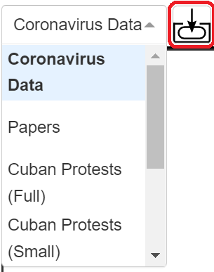

### Parameters and Constraints
Now that we have loaded the data, we can generate a narrative map. For the Coronavirus data set, a good starting map can be found with the following parameters: K = 6 (expected length of 6 for the main story) and mincover = 20 (expected to cover at least 20% of each topical cluster on average). Do not worry about the temporal sensitivity parameter yet, as that parameter is usually more applicable to data sets that span longer periods of time and by default it is ignored. Our COVID-19 data set only spans about a month, so it's a short enough period of time that we should not worry about it.

Furthermore, we are going to fix a starting and ending event. This is not strictly necessary, but for the purposes of this example, it works better than generating a map without these constraints. We will keep it simple for this case, the first document in the data set will be the start event and the last document of the data set will be the ending event. To impose these constrains, we need to go to the "Data Set" tab and mark the checkboxes of the two events. You will need to move to the second page of the data set to mark the last event (see page controls at the bottom).

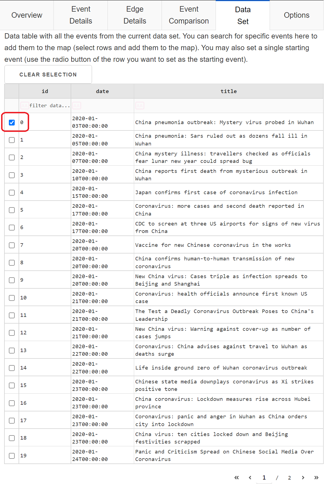

Note that our prototype currently supports having no start/end constraints (don't click any checkbox), just a start constraint (click one checkbox), and both a starting and ending event constraint (click two checkboxes). There is no support for a fixed ending event without a fixed start in the current version.

To generate the map, we set the parameters as mentioned above and click the map generation button. 

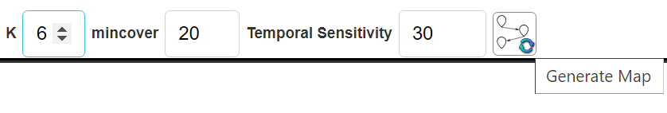

You should see a status message besides the map generation button showing the following elements: the status of the linear program ("Optimal" if a solution was found and "Unfeasible" if no solution was found), the number of topical clusters in the data set, and the number of storylines (note that this count includes both the big stories surrounded by gray boxes and "singleton storylines" that contain a single event). These results are mostly for debugging purposes. In particular, if you find that the linear program is unfeasible, that points towards either the parameters being too strict (e.g., high coverage in a data set with many clusters) or conflicting constraints (e.g., adding an edge and then removing one of its events).

## Basic Navigation and Functions
### Map Elements
The narrative map contains event nodes and edges connecting these nodes. The event nodes are organized into storylines (the gray boxes). The box with the blue connections is the main storyline, the others boxes correspond to side storylines. Some events are not contained in any box, we call these isolated events "singleton storylines" (i.e., a storyline with a single event). There are also events in the background (the gray nodes) that represent events that are similar to those in the map, but didn't make the cut, due to the optimization algorithm not finding them optimal enough to include (or maybe because the post-processing steps eliminated them due to low coherence values).

There are some events that are considered important. In particular, there are two types of important events: 
- Representative events: these events are representative of their storyline due to their content (based on the "centroid" of the embeddings of all events in the story). They are highlighted by red boxes in the map. Each storyline has its own representative event (except singleton storylines). Note that since this is computed at a storyline level, these events could be considered "locally" important.
- Structurally important events: these events are structurally important in the map based on their connections (i.e., node degree). They are highlighted by blue boxes in the map. Note that since this is computed at a map level, these events could be considered "globally" important.

Next, we note that there are labels above the connections (note that sometimes connections can have multiple labels). These labels show the type of connection, providing an explanation of why the extraction algorithm connected them. In general, there are three types of connections:
- Similarity: based on the text similarity of the events and also used as the default connection type.
- Topical: based on the topical similarity of events. 
- Entity: based on the events sharing a common entity.

### Moving Events, Zooming, and Panning
To move around the map, we can simply hold left click and move the mouse around, this will move the canvas. To zoom in and out, you can use the scroll wheel. However, depending on the configuration of your scroll wheel, you might scroll too fast. If that's the case, you could use the zoom buttons shown below. Note that the third button resets the map back to its default zoom level.

You can re-arrange the layout of the graph by clicking and dragging single events or even whole storylines (the big gray boxes). Note that these layout changes do not have any effect on the model.

### Exporting the Map
You can export the current view of the map in PNG format and the full data of the map in JSON format using the export buttons. Note that the PNG export only covers the currently visible map.

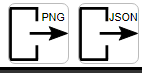

### Overview Tab
Let's check the "Overview" tab now. This tab contains a summary of three key elements: the projection space (with a visualization of the topical clusters and the main storyline as it navigates these clusters), the relevant keywords of each topical cluster (based on TF-IDF scores), and an entity list (sorted by frequency). The purpose of this tab is to provide a general view of the contents of the data set. Knowing how the main storyline navigates the embedding space could also be useful for debugging purposes. Also, the projection space might change significantly if the "add to cluster" interaction is used.

### Event Details Tab
Let's now check the "Event Details" tab. Click any event and the details tab will be filled with the contents of the article, including the headline, publication date, URL if available, and the full text.

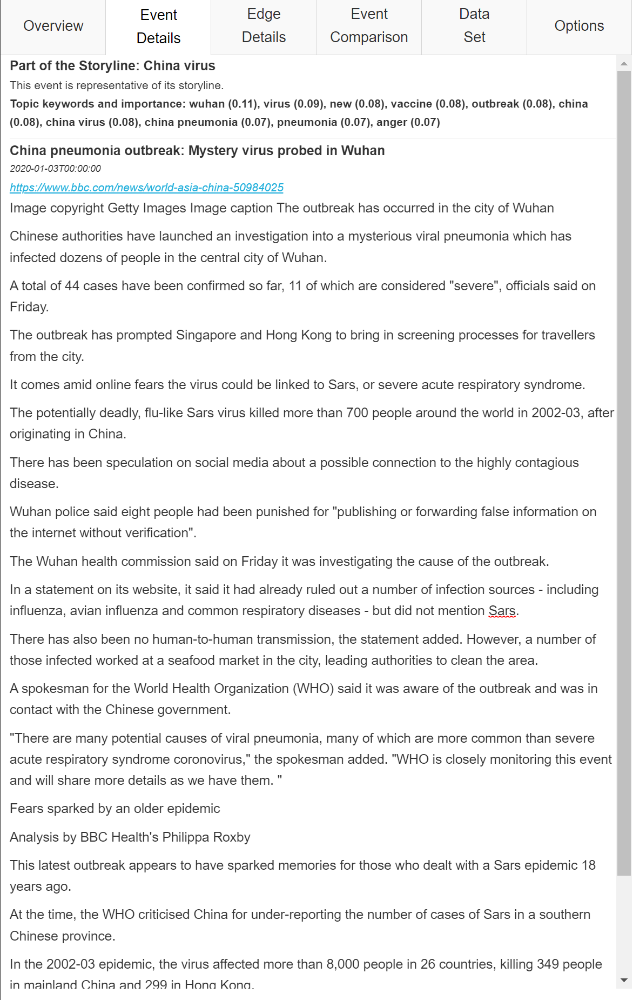

There is also some additional information about the event. In particular, we can see the following elements:
- Storyline to which the event belongs.
- Topic keywords and importance based on the clustering information of the event in the projection space.
- If the event is considered "important" we see a brief explanation (e.g. "This event is representative of its storyline" or "This event is structurally important, it as a hub in the map").

## Analyzing the Map
### Map Analysis
Now that we have a map, it should look like the map below, but it might be mirrored or arranged slightly different depending on how the computation of the layout algorithm goes. However, the contents should be the same (unless there is an update on PythonAnywhere that messes everything up). Note that time flows from top to bottom in the map (although positions might not be strict across storylines), but the background events (gray dots) are not ordered by time, just similarity.

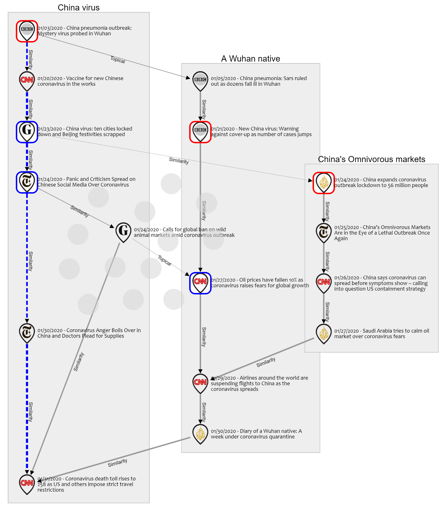

This map has three "big" storylines and one "singleton" storyline. 

The main storyline (in blue) covers the start of the pandemic with the first signs of the "mystery virus" in Wuhan and then it goes to show the progress until we get to a death toll in the hundreds and the US and others imposing travel restrictions. There are also mentions of a vaccine in the works, which shows that even at the start of the pandemic before it became something global there was already work being done in that aspect. Furthermore, we see how lockdowns in China led to panic and cricisism in social media, and then lack of medical supplies caused anger. Thus, the storylines gives us some insight into the social effects that the pandemic had in China at the start, as well as showing the progression of the pandemic from a "mystery virus" to a global menace.

We can also check the side stories, the first one to the right seems to cover the spread of the virus in Wuhan, followed by a potential cover-up as the spread is uncontained, this eventually leads to oil prices falling due to fears of the coronavirus affecting global growth. In turn, this leads to airlines suspending flights to China as the virus spreads. The last event is about life in Wuhan, but this isn't particularly relevant. The one on the right seems to cover more developments of the virus in China, focusing on the lockdowns and omnivorous markets. The last two events are more interesting, with hints of the US containment strategy not being useful, and Saudi Arabia trying to calm oil markets. In conjunction with the other event about oil prices, these two lead to the event about airles, which is related, as travel restrictions and suspensions have a likely direct influence on oil prices.

The singleton storyline / isolated node just adds some extra information about the omnivorous animal markets again. We can check its details by clicking the event and opening the "Event Details" tab.

### Semantic Interaction Example 1
In this example, we use the **Remove Event** and **Add to Cluster** interactions

#### Performing the Interactions
From our discussion above, we can see that there are some events that do not really fit or do not provide useful information. So let's leverage our **semantic interaction** capabilities and influence the map by removing these events. In particular, we remove three events:
- China's Omnivorous Markets Are in the Eye of a Lethal Outbreak Once Again
- Calls for global ban on wild animal markets amid coronavirus outbreak
- Diary of a Wuhan native: A week under coronavirus quarantine

To do this, we select the events and remove them using the remove event button. Note that we can remove them one by one by clicking them and then clicking the button, or we can use **shift-click** to select multiple events at a time. This is going to add a constraint into the structure space by forcing the optimization algorithm to set these events to have a value of zero coherence. This is how selecting and deleting the nodes would look like:

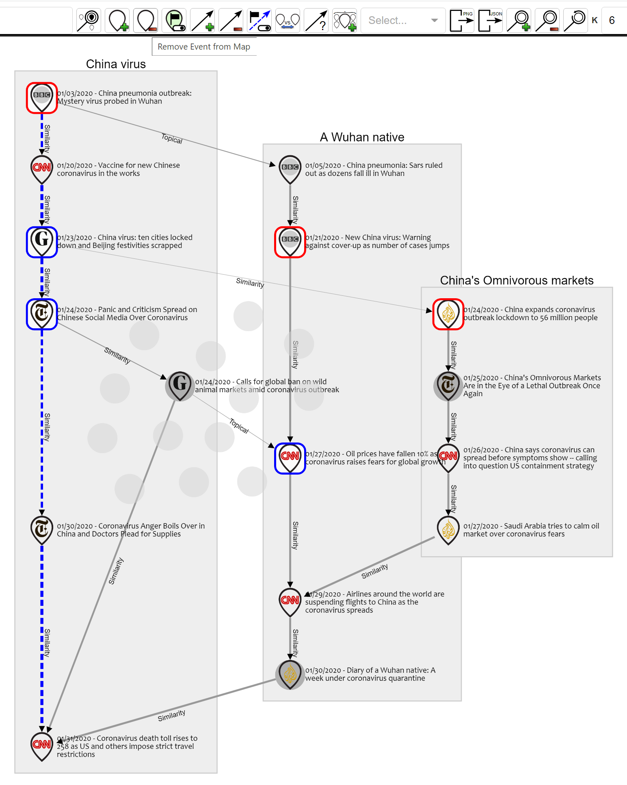

Furthermore, we note that there is these three events close together that relate to economic impacts (oil prices and airlines suspending flights). We are going to ensure that these events stay clustered together by using the "add to cluster" functionality. You have to select the cluster to which you want to assign these events. In our example, we assign the events to cluster 1, which is represented with the light blue color (hence "lblue" in the dropdown menu). This will impact the underlying projection space and ensure that these events are close together (using semisupervised UMAP). Moreover, extra connectivity constraints are added to the structure space, seeking to ensure that these events are at least weakly connected in the resulting map.

Now, let's see the effect that this has on the extraction algorithm. Let's extract the map again (we do not change any parameters explicitly here).

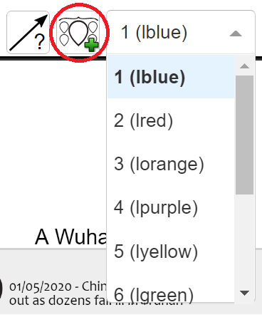

#### Analyzing the map after interactions
After generating the map with all these interactions, we get the following map:

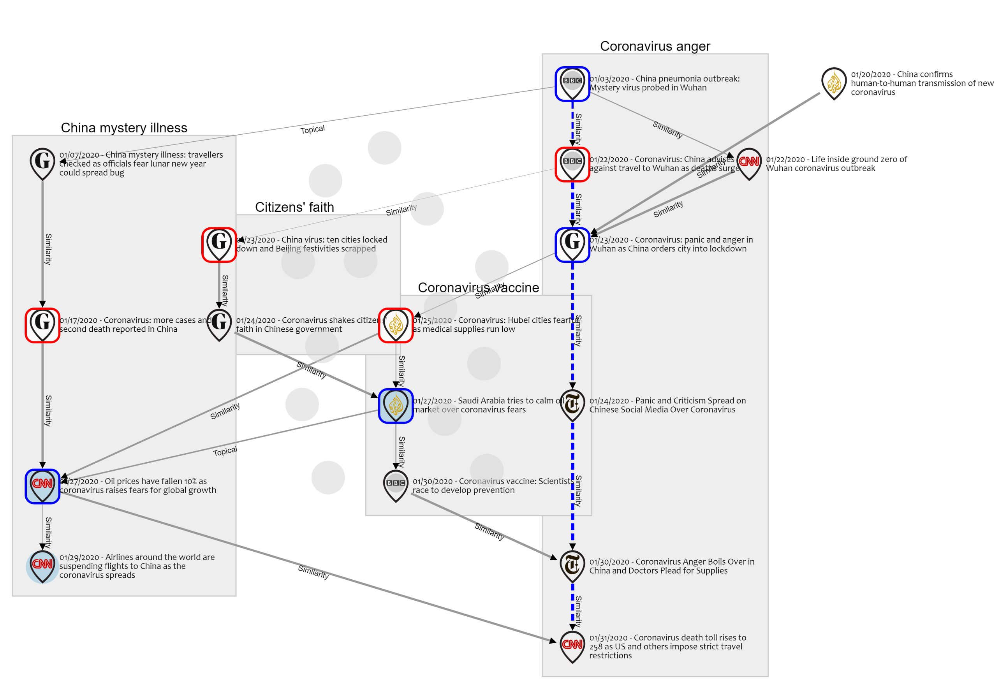

The main storyline is aptly named "Coronavirus anger" and it indeed focuses on the social response to the virus and all the panic and anger caused by the pandemic, including the lockdowns and lacks of supplies. Interestingly, one of the singleton storylines about human-to-human transmission feeds into the "lockdown" event (highlighted in blue as structurally important). This connection makes sense, as one would expect that this information led to the lockdowns. The other singleton event about life inside ground zero is just side information, and not particulalry relevant. 

Regarding the side stories, the one on the far left starts with the spread of the virus and its effects on lunar new year, followed by the oil prices decline and the airlines suspending flights. This could be interpreted as a side storyline focused on the economic effects (with some extra background). There's a small side story with only two events, this storyline shows how the Chinese festivities were scrapped (the lunar new year), leading into the virus shaking Chinese citizens' faith in the government. 

The final side story has information about how supplies are running low in Hubei and the Saudi Arabia trying to calm the oil markets (which seems to fail as there is a direct connection to oil prices falling in the other storyline on the same day, a relevant inter-story connection), followed by news on the development of the Coronavirus vaccine. This storyline seems to imply that the development of the vaccine could be driven by fear of the economic effects of the virus on supply chains or the market in general. Thus, this could be interpreted as another economic effects storyline. 

### Semantic Interaction Example 2
In this example, we start with the same map but use a different sequence of interactions, including **Add Event**, **Remove Event**, **Add Edge**, and **Remove Edge**. This effectively covers all the interactions that affect the structure space. Note that in this example we do not alter the projection space. We reset the system by refreshing the webpage and create a map following the same steps as before.

Our goal now will be to modify the map so it creates a storyline about economic effects. To do so, we start by removing the same nodes from before about the omnivorous/animal markets and the diary of a Wuhan native. However, instead of creating a cluster, we simply add an edge between the oil prices event and the Saudi Arabia event. We can do this by selecting both events using shift-click and then press the add edge button, as shown in the image.

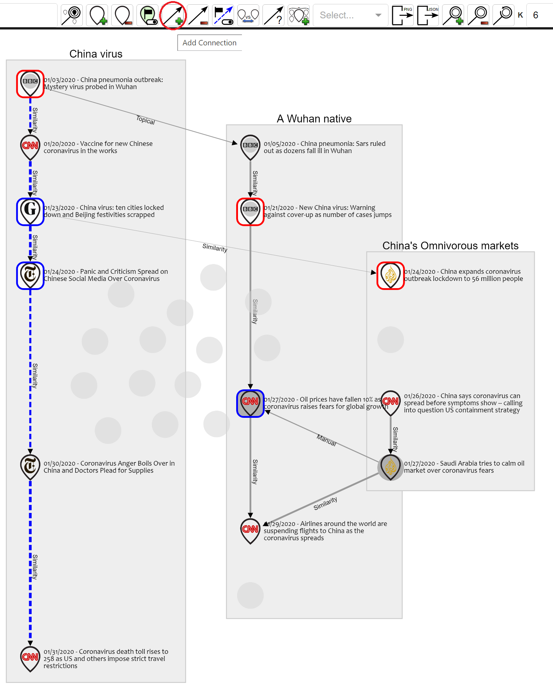

Furthermore, we will add more related events to the market using the "Find in Map" function which will search for specific keywords in all the events currently present in the canvas (including gray dots and events in the map). The search function works on the headlines of the events and it allows searching for exact matches like "markets" or for partial matches like "market\*" (which would match market, markets, and marketing). The asterisk can also be used at the start of the word (or even at both ends). We will use the "market\*" query and this is what the results should look like at this point:

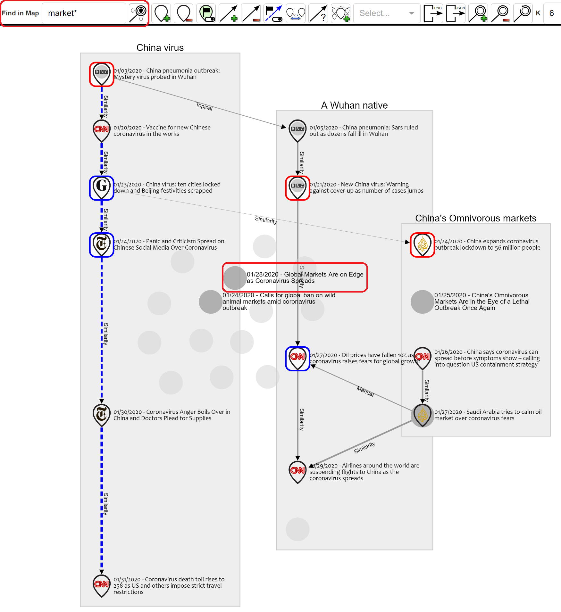

From the highlighted events, we add the event about markets being on edge using the add event button, as that is the only relevant event. Then, we add an edge between this new event and the oil markets by selecting both of them using shift-click, as shown below. Note that we could have manually searched through the background events by clicking them one by one (doing so would show the headlines of the article) until we found something that was interesting instead of using the "Find in Map" function.

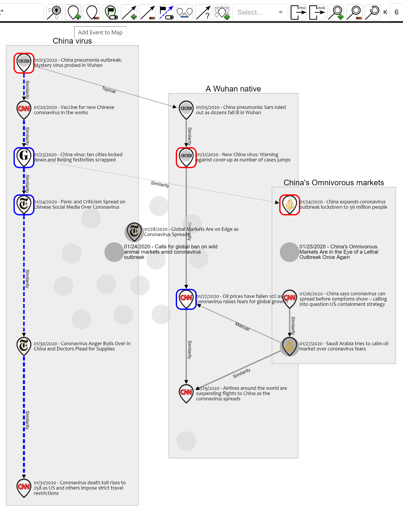

Since adding a single event is likely not enough, we are going to look into the data set for more potentially useful events. So we seek additional market-related events in the "Data Set" tab. In particular, we find an event about Asian markets closing with losses. We add this event by selecting the corresponding cell (as shown in the image) and clicking the add event button. Note that the event will appear in the middle of the map without any connections.

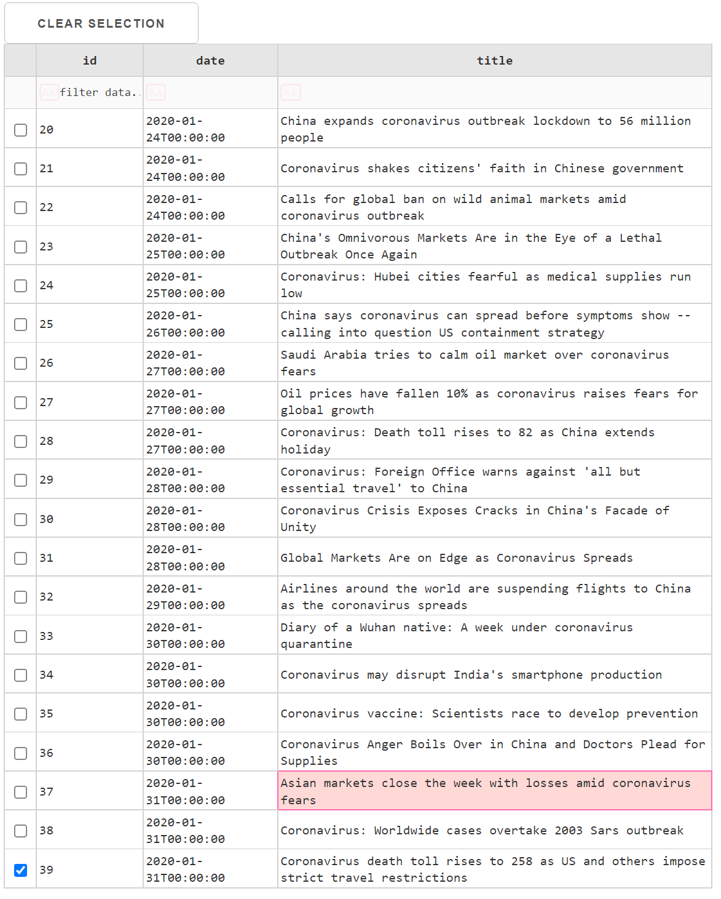

We regenerate the map with these interactions and get the following map. It seems to cover the economic effects decently enough in one of the side stories.

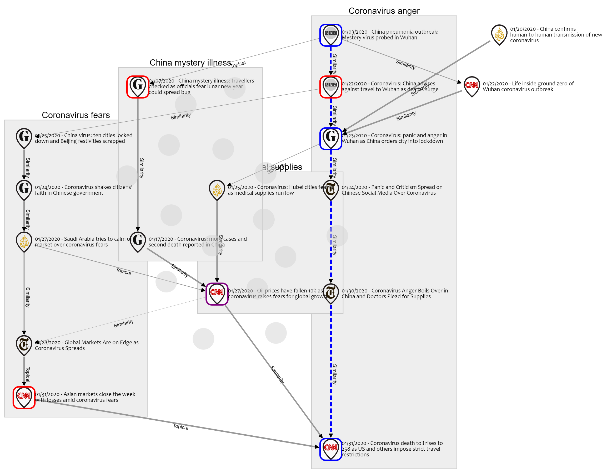

Finally, we note the isolated event about the life inside ground zero on the right. For the purposes of this example, we will show another approach to remove this event from the map without explicitly deleting it. Instead, we remove the edges connecting to the event by selecting them with shift-click, as shown below. 

Then, we regenerate the map once again. Two things can happen after doing this, either the algorithm finds a new way to connect this event to the rest of the map, or the new solution outrights omit it (and maybe it event brings new information instead of it).

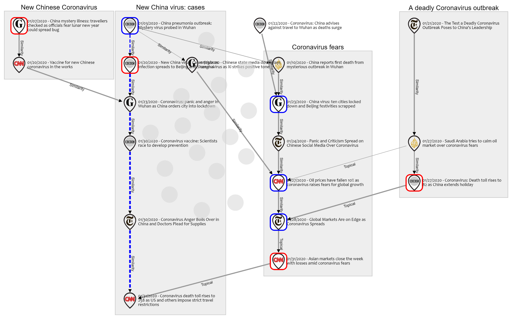

As we can see, the final map does not include the event about life inside ground zero. Thus, we removed irrelevant information by using the remove edge interaction instead of explicitly removing the node itself. The rest of the map seems to cover economic effects on its side storylines well enough, which was the purpose of our interactions in this example.

## Advanced Options and Other Interactions
Now that we have worked through two examples, let's see some other interactions that could be useful and a. 

### Additional Map Interactions
There are two additional interactions that currently have no effect on the underlying model through semantic interaction: toggle main storyline and toggle important event. 

To change a regular edge into part of the main storyline, you have to select that edge and press the "Toggle Main Storyline" button. You can change multiple edges at the same time by using shift-click to select them. Likewise, you can turn main storyline edges into regular edges following the same approach. Changing important events follows the same approach, but at a node-level instead. Note that the important event only affects representative events (highlighted in red), not structurally important events (highlighted in blue).

### Edge Details Tab
Let's now check the "Edge Details" tab. Click any edge and the tab will be filled with basic information about the edge, including the source event, target event, and its weight (normalized coherence). 

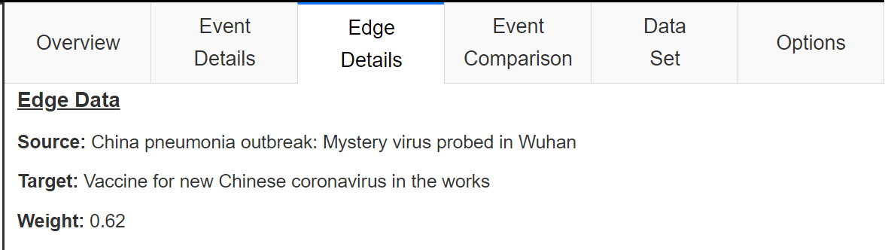

If you wish to see more detailed information, you must press the "Explain Edge" button, which will fill the tab with some additional information depending on the type of connection (the label that appears on the edge). The exact explanations will depend on the type of connection (similarity, topical, or entity), but all of them will show a plot with the keyword contributions towards the connection.

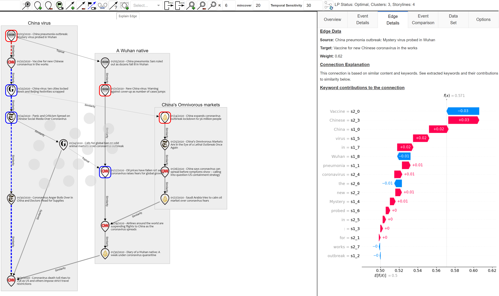

### Compare Events Tab
Similar to how we explain connections, we may also compare events that were not connected by selecting two of them (using shift-click) and then pressing the "Compare Events" button. 

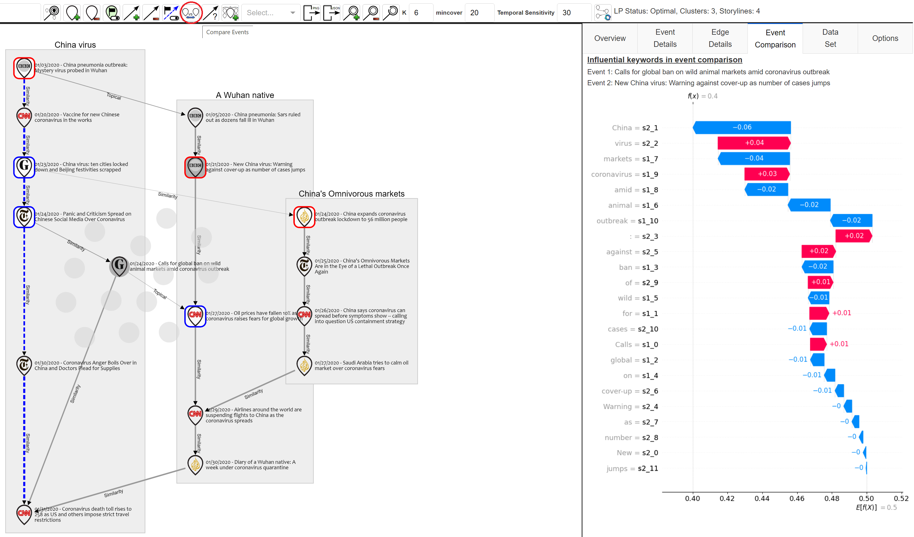

This shows the compared events and then generates a plot with the keyword contributions toward basic event similarity. This information can be useful to check why a specific pair of events has not been connection.

### Options Tab

The options tab contains some extra settings that we can manipulate for map generation.

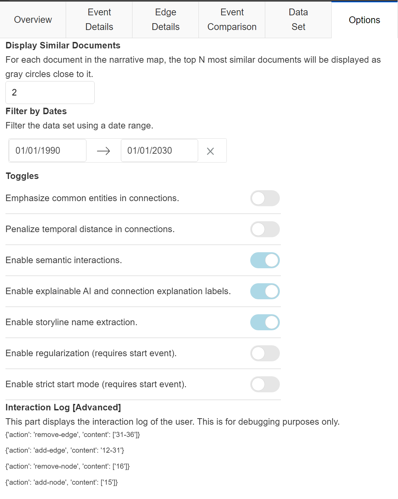

1. Display Similar Documents: This number influences the number of gray dots that appear in the background (events that did not make it to the map but are similar to events in the map). By default, for each event in the map, we select the top 2 most similar events from the data set that are not already in the map and add them to the background. Depending on the size of your data set, you might want to increase this, but higher values lead to denser background layouts, which may make it impractical.
2. Filter by Dates: This filters the data set based on dates. By default we include all our data sets in full, but you might want to narrow it down to some specific range. To apply this setting, you must reload the data set. 
3. Toggles:
    - Emphasize common entities in connections: If turned on, the extraction algorithm will include an extra weight term in the coherence computation based on the number of common entities between two events. This is recommended in data sets where entities are highly relevant (e.g., the Crescent data set). Note that the basic extraction method does not assign extra weight based on common entities, but it still can generate entity-based connections if there are enough common entities. This setting is not recommended for data sets where entities do not provide much information (e.g., the COVID-19 data set, where all events mention the "China" entity). This toggle is turned off by default. 
    - Penalize temporal distance in connections: If turned on, the extraction algorithm will include an extra weight term in the coherence computation based on the temporal distance between two events. The usefulness of this setting depends on the time period covered by the data set and its temporal density. In general, this is recommended in long-spanning data sets (e.g., the Cuban data set), unless the temporal density is low. This setting is not recommended for data sets with shorter time spans, unless it is a very dense data set (e.g., a month period with hourly events). This toggle is turned off by default.
    - Enable semantic interactions: This enables the use of semantic interactions to change the projection space and the structure space based on user feedback. If you do not want to use the semantic interaction capabilities of the prototype, then turn this off. This toggle is turned on by default.
    - Enable explainable AI and connection explanation labels: This enables the use of the explainable AI component (generating edge labels, explaining edges, and comparing nodes). If you do not want to use the explainable AI module or you want to reduce computational cost, then turn this off. This toggle is turned on by default.
    - Enable storyline name extraction: This enables the extraction of storyline names. If you do not want to generate names for the storylines or want you want to reduce computational cost, then turn this off. This toggle is turned on by default.
    - Enable strict mode (only if a start event is provided): If a start node is provided, strict mode will remove all components of the graph that are not connected to the start node through extra post-processing. This toggle is turned off by default.
4. Interaction Log: This log is for debugging purposes and shows the sequence of interactions done by the user. It is used by the semantic interaction module to determine the changes to the projection and structure space. 

